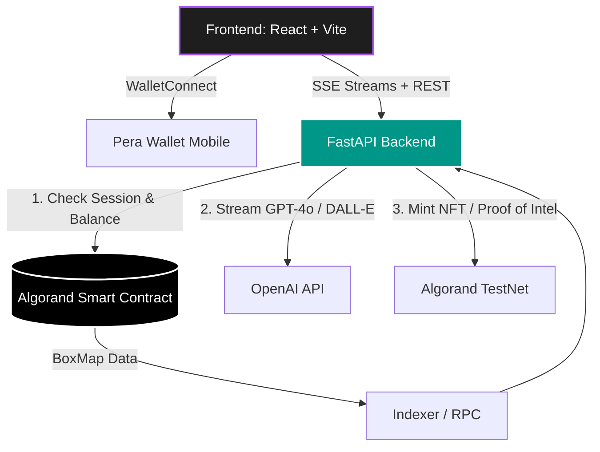

<div align="center">
  
  

  <h1 align="center">🌌 PayPerAI</h1>
  
  <p align="center">
    <b>The Future of Blockchain-Gated AI & One-Click NFT Generation</b>
  </p>

  <p align="center">
    <a href="https://developer.algorand.org/">
      
    </a>
    <a href="https://react.dev/">
      
    </a>
    <a href="https://fastapi.tiangolo.com/">
      
    </a>
    <a href="https://openai.com/">
      
    </a>
  </p>

  <p align="center">
    
  </p>
</div>

<br />

## 📖 About The Project

**PayPerAI** is a state-of-the-art decentralized platform bridging the gap between premium Web2 AI tools and Web3 decentralized finance. We solve the issue of bloated monthly AI subscriptions by introducing a frictionless **Pay-Per-Use** model powered by the **Algorand Blockchain**. 

Users connect their wallets, authorize a 24-hour smart contract session, and get instantly charged *only for the exact AI tokens they consume*. No credit cards. No lock-ins.

---

## ✨ Features That Make Us G.O.A.T. 🐐

<table align="center">
  <tr>
    <td width="50%">
      <h3>⚡ Real-Time AI Streaming (SSE)</h3>
      <p>Experience ultra-fast, character-by-character AI typing exactly like ChatGPT. No waiting for long queries—responses stream directly to your UI while the backend seamlessly calculates costs and updates the blockchain in the background.</p>
    </td>
    <td width="50%">
      <h3>🧠 AI Image Studio (DALL-E 3)</h3>
      <p>Generate world-class, high-fidelity AI art directly within the platform. Our integration ensures every prompt results in an absolute masterpiece.</p>
    </td>
  </tr>
  <tr>
    <td width="50%">
      <h3>⏱️ Smart Session Management</h3>
      <p>A flawless Web3 UX: Authorize a 24-hour session via Pera Wallet just <b>once</b>. Enjoy auto-renewal logic, a live session countdown timer, and automatic UI prompts when your session expires. No more signing transactions for every single chat message!</p>
    </td>
    <td width="50%">
      <h3>💎 1-Click NFT Minting</h3>
      <p>Transform your AI creations into permanent on-chain ARC-69 assets with zero technical friction. Minted instantly and delivered straight to your Pera Wallet.</p>
    </td>
  </tr>
</table>

---

## 🚦 Live Demo & Quick Start

> 🔗 **Live URL:** **[https://debuggers-united.sandy.vercel.app](https://debuggers-united.sandy.vercel.app)**
> 
> *No local setup required. Optimized for Algorand TestNet.*

### The 5-Step Magic Workflow

1. 🦊 **Connect Wallet:** Click "Connect Wallet" and scan the WalletConnect QR with your Pera app. *(Switch your Pera app to TestNet!)*
2. 🤖 **Pick an Expert AI:** Choose from our arsenal (Code Reviewer, Business Evaluator, Image Studio, etc.)
3. 💰 **Authorize Session:** First time? Deposit a small ALGO escrow and sign **once** to open a 24-hour session.
4. 💬 **Stream Answers:** Chat with the AI and watch the response stream in real-time. Token costs auto-deduct transparently.
5. 🖼️ **Mint Art:** Go to Image Studio, generate a DALL-E 3 masterpiece, and click "Mint as NFT" to get your ARC-69 asset.

---

## 🚀 Key Architectural Innovations

### 1. The Seamless "Smart Session" Engine
Unlike traditional dApps that force you to sign a pop-up for *every single interaction*, PayPerAI uses an advanced Escrow + Session model:
- You authorize a **24-hour session max-spend** via the Algorand Smart Contract (`start_session`).
- As you chat, the backend validates your session on-chain and streams the AI response.
- Costs are tallied in the background and synced to the blockchain seamlessly.
- **Result:** Web2 UX speed with Web3 security.

### 2. On-Chain Proof of Intelligence 🧬
Every AI response triggers a **fire-and-forget Algorand note transaction** embedding a SHA-256 hash of the AI output on-chain. 
- Immutably proves **who** requested the AI response, **what** was generated, and **when**.

### 3. Dynamic BoxMap Smart Contract (Puya/Python)
Our contract utilizes Algorand's latest `BoxMap` technology to handle dynamic pricing and session expiry natively:
- `request_service_v2()` — Validates session expiry and balance limits.
- `start_session()` — Initializes the 24-hour timer.
- Fully ABI-compliant and indexer-readable.

---

## 🧱 Architecture Diagram



---

## 💻 Tech Stack

<div align="center">
  
</div>

| Layer               | Technology                               | Purpose                                                       |
| ------------------- | ---------------------------------------- | ------------------------------------------------------------- |
| **Smart Contract**  | Algorand Puya/Python (ARC4)              | On-chain sessions, BoxMap escrow, automated verification      |
| **Backend API**     | Python FastAPI                           | SSE Streaming, AI orchestration, NFT minting pipeline         |
| **Frontend**        | React 18 + TailwindCSS + Vite            | Dark mode, glowing UI, real-time streaming, session timers    |
| **Wallet SDK**      | @perawallet/connect + algosdk v3         | QR connection, atomic transaction grouping                    |
| **AI Models**       | OpenAI GPT-4o & DALL-E 3                 | Advanced multi-turn conversation & image generation           |

---

## ⚙️ Setup & Run Instructions

### 1. Clone & Setup Backend
```bash
git clone https://github.com/WPrasad99/Pay-Per-Use-Ai.git
cd Pay-Per-Use-Ai/backend
python -m venv venv
# Activate venv: `venv\Scripts\activate` (Win) or `source venv/bin/activate` (Mac/Linux)
pip install -r requirements.txt
```

### 2. Configure `.env` (in `/backend`)
```env
OPENAI_API_KEY=sk-your-key
ALGORAND_NETWORK=testnet
ALGOD_URL=https://testnet-api.algonode.cloud
PLATFORM_WALLET_ADDRESS=YOUR_WALLET
PLATFORM_WALLET_MNEMONIC=your 25 words...
ALGORAND_APP_ID=YOUR_APP_ID
```

### 3. Run It!
**Backend:**
```bash
python -m uvicorn app.main:app --reload --port 8000
```
**Frontend:**
```bash
cd ../frontend
npm install
npm run dev
```

---

<div align="center">
  <br />
  <p>
    <b>Built with ❤️ by Team Debuggers United</b>
  </p>
  
</div>
